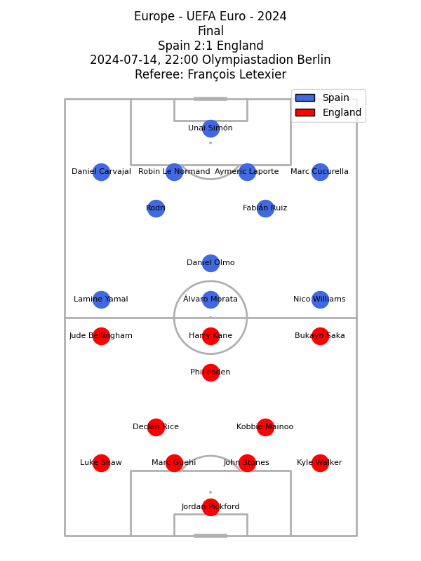

# ⚽ AI-based Player Evaluation using StatsBomb Data

This repository contains all the code and data processing steps used in my master's thesis project:  
**“Application of Artificial Intelligence and Machine Learning in the Analysis of Football Actions: A Player Evaluation Model for Scouting Purposes.”**

## 🎯 Project Goal

The goal of this project is to build a machine learning-based player evaluation model that assists in the football scouting process.  
The model aims to provide an **initial, objective rating of outfield players** based on detailed event-level data, helping scouts to identify players worth further observation.

## 🗂️ Data Source

All data used in this project comes from the open dataset published by [StatsBomb](https://github.com/statsbomb/open-data).  
The analysis focuses specifically on the matches from **UEFA EURO 2024**, including both standard event data and available 360° contextual frames.

## 🧠 Features

### 📋 Lineups

This project includes tools for extracting and displaying **starting lineups** from StatsBomb data in a structured and readable format.

```python
import src.lineups.matches as ln

ln.display_match_lineups(3943043)			# no title
ln.display_match_lineups(3943043, 55, 282)		# with title generated using competition data 
```

The function above retrieves and formats the starting XIs for both teams in a given match — in this case, the final of UEFA EURO 2024. It uses lineup data from the statsbombpy library and maps player positions according to StatsBomb’s taxonomy.


Visual representation of starting lineups for match ID 3943043.

This information is essential for:
- Understanding players’ tactical roles,
- Comparing positional context when evaluating actions and metrics,
- Enhancing the interpretability of player ratings generated by the model.

### Events 

#### List of all possible event types

```python
import src.utils as utl

type_counts = utl.get_events_type_counts(3930167)

type
Pass                 1023
Ball Receipt*         960				
Carry                 875
...				
Shield                  1
Error                   1
Name: count, dtype: int64
```
| Event Type          | Count | Description |
|---------------------|-------|-------------|
| Pass                | 1023  | A pass between two players of the same team. |
| Ball Receipt*       | 960   | An attempt by a player to receive a pass. |
| Carry               | 875   | A player's movement with the ball over a distance. |
| Pressure            | 326   | Applying pressure to an opponent in possession to force an error. |
| Ball Recovery       | 101   | Regaining possession of a loose ball, usually after an interception or rebound. |
| Duel                | 53    | A contested situation between two players competing for the ball. |
| Goal Keeper         | 41    | All goalkeeper-specific actions such as saves, claims, and punches. |
| Clearance           | 39    | A defensive action to clear the ball away from danger. |
| Block               | 38    | Blocking an opponent’s shot or pass. |
| Miscontrol          | 37    | A failed ball control resulting in loss of possession. |
| Shot                | 35    | An attempt to score a goal. |
| Dribble             | 32    | Attempting to beat an opponent with the ball at feet. |
| Foul Committed      | 29    | A foul committed by a player, resulting in a free kick or penalty for the opponent. |
| Foul Won            | 28    | A foul suffered by the player, earning a free kick or penalty. |
| Interception        | 23    | Interrupting and taking possession of a pass from the opponent. |
| Dribbled Past       | 20    | When a player is beaten by an opponent in a dribble. |
| Dispossessed        | 12    | Losing the ball to an opponent during play. |
| Substitution        | 9     | A player substitution made during the match. |
| Injury Stoppage     | 7     | A stoppage in play due to a player's injury. |
| 50/50               | 6     | A situation where two players have an equal chance to win a loose ball. |
| Half Start          | 4     | The official start of a half. |
| Half End            | 4     | The official end of a half. |
| Referee Ball-Drop   | 4     | The referee restarts play by dropping the ball. |
| Tactical Shift      | 3     | A change in tactical formation or player positions. |
| Bad Behaviour       | 2     | Misconduct or unsporting behavior not directly related to a foul. |
| Offside             | 2     | A player is flagged offside at the moment a pass is played to them. |
| Starting XI         | 2     | Initial lineup of players for each team at kickoff. |
| Own Goal For        | 1     | An own goal scored by the opposing team, benefiting the player’s team. |
| Own Goal Against    | 1     | An own goal scored by the player’s team, benefiting the opponent. |
| Player On           | 1     | A player entering the field, e.g., after a substitution. |
| Player Off          | 1     | A player leaving the field without being substituted. |
| Shield              | 1     | A player shielding the ball to maintain possession or allow it to go out of play. |
| Error               | 1     | A mistake leading directly to a goal-scoring opportunity. |

#### Passes

**pass_type**
```python
['Kick Off', nan, 'Goal Kick', 'Recovery', 'Throw-in', 'Corner', 'Free Kick', 'Interception']
```

**pass_outcome**
```python
[nan, 'Out', 'Incomplete', 'Unknown', 'Pass Offside']
```

**pass_goal_assist** - Is this pass an assist
```python
[nan, True]
```

**play_pattern**
```python
['From Kick Off', 'From Goal Kick', 'From Throw In', 'Regular Play', 'From Corner', 'From Counter', 'From Free Kick', 'From Keeper', 'Other']
```


## 🧪 Tools & Technologies

- **Python**
- `pandas` – data processing  
- `statsbombpy` – modified by me to access local data  
- `mplsoccer`, `matplotlib` – visualizations  
- Machine Learning (to be added in the next phase)

## 🧠 Future Work

- Feature engineering for ML model
- Model training (e.g., classification or regression of player performance)
- Evaluation using post-tournament player reputation or expert data

## 🧾 License

This project uses data from StatsBomb under their open data license. Please cite appropriately when reusing the dataset.

---

📬 Questions or feedback? Feel free to contact me or open an issue.